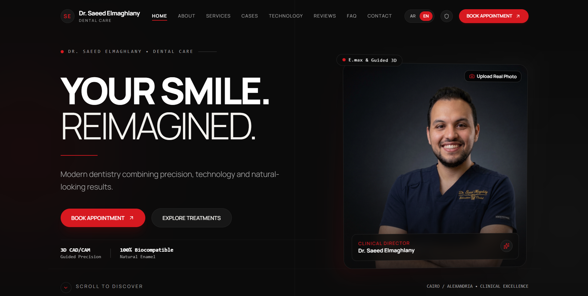

# Dr. Saeed Elmaghlany — Dental Care

A premium bilingual website for a modern dental clinic, designed around trust, clinical precision, clear service discovery, and easy appointment booking.



## Features

- Arabic and English UI with RTL/LTR support
- Treatment and technology presentation
- Before-and-after cases and patient reviews
- FAQ and contact sections
- Appointment booking flow
- Admin interface for clinic content
- Responsive cinematic design and polished motion

## Stack

React 19, TypeScript, Vite, Tailwind CSS, Lucide React, and Recharts.

## Run

```bash
npm install
npm run dev
```

Production build: `npm run build`.

## Author

Mazen Mohamed Ali — Full-Stack Developer & UI/UX Designer  
[GitHub Profile](https://github.com/mazenalfky176-ux)
